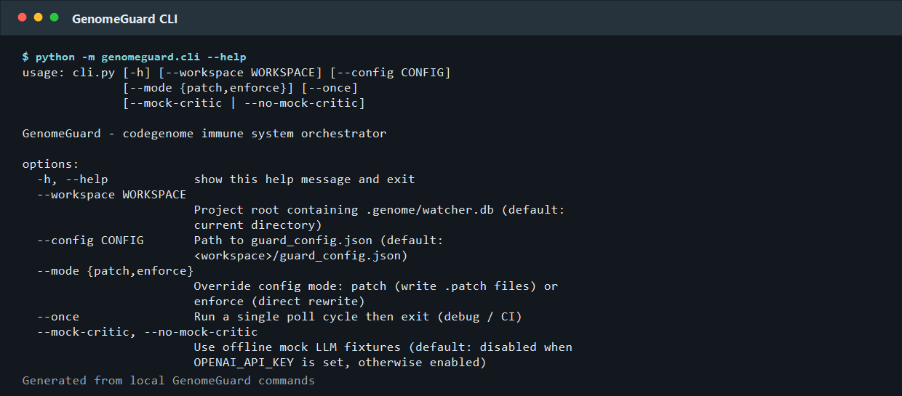
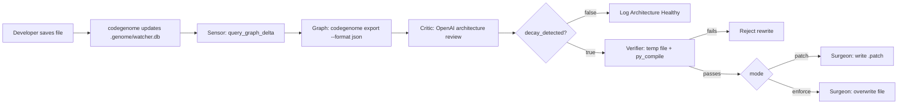
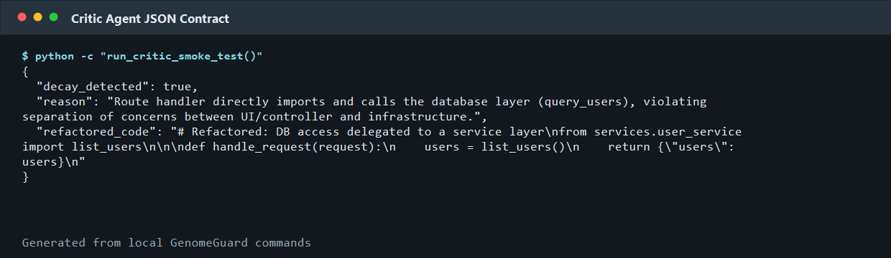
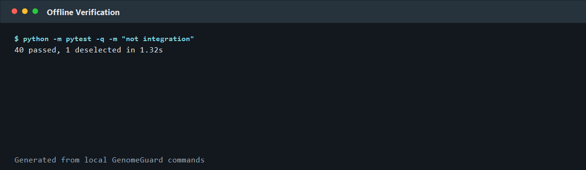

# GenomeGuard

**AI-native architecture immune system for Python codebases.** GenomeGuard watches a live `codegenome` graph, asks OpenAI to reason over architectural decay, verifies the proposed repair, and produces a safe patch or enforced rewrite before the design damage spreads.

**Author:** Md. Fatin Shadab Turja



## The Problem

Modern teams do not usually break architecture with one dramatic decision. They break it through hundreds of small, reasonable shortcuts: route handlers importing database code, UI code reaching into infrastructure, circular dependencies, and complex functions that slowly become impossible to review.

Traditional linters are valuable, but they mainly catch local syntax, style, and rule patterns. Architectural decay is different. It is semantic and contextual. A direct database import may be fine in one layer and dangerous in another; a refactor may need dependency graph context, not just a regex.

GenomeGuard targets that gap: **real-time architectural review for changed code, with graph context and a safety gate before any AI-written change is allowed to touch the project.**

## The Solution

GenomeGuard turns architectural governance into a four-agent workflow:

1. **Sensor Agent** detects the latest changed file from `.genome/watcher.db`.
2. **Critic Agent** sends the changed source, compact graph context, and project rules to OpenAI.
3. **Verifier Agent** compiles the AI-proposed rewrite in a temporary shadow file.
4. **Surgeon Agent** writes a unified diff patch by default, or directly enforces the rewrite when configured.

This is AI-native because the central task is not simple classification. The system asks the model to reason across source code, dependency topology, and human-written architecture rules, then synthesize a corrected full-file implementation. Hard-coding that behavior would require brittle rule engines for every framework, layer naming convention, and codebase style. GenomeGuard instead uses OpenAI as the semantic architecture critic, while deterministic Python code handles memory, orchestration, verification, and writes.

## Judging Criteria Alignment

| Criterion | How GenomeGuard addresses it |
| --- | --- |
| **AI-Native Thinking** | Uses OpenAI to evaluate architecture from changed code plus dependency graph context, not just tokens or static patterns. The model returns structured JSON with a diagnosis and complete refactor candidate. |
| **Agent Design / Workflow** | Implements four explicit personas in `AGENTS.md`: Sensor, Critic, Verifier, and Surgeon. `skills.md` documents the callable internal capabilities that drive the loop. |
| **Creativity** | Treats the codebase like a living system with an immune response: detect mutation, diagnose decay, verify treatment, and apply a safe patch. |
| **Practical Impact** | Gives developers reviewable `.patch` files by default, supports direct enforcement for trusted workflows, and avoids whole-repo scans by reacting only to graph deltas. |

## How It Works: Agentic Workflow



| Workflow capability | Implementation |
| --- | --- |
| **Planning** | The Critic prompt in `src/genomeguard/critic.py` instructs the model to detect circular dependencies, high complexity, and separation-of-concerns violations, then return a complete correction plan as structured JSON. |
| **Tools** | `codegenome export --format json`, SQLite read-only watcher access, OpenAI Chat Completions, `python -m py_compile`, and `difflib.unified_diff`. |
| **Memory** | `.genome/watcher.db` stores graph mutation state, `guard_config.json` stores active rules and runtime mode, `.genome/graph.json` stores exported graph context, and encrypted local storage can hold the OpenAI API key. |
| **Orchestration** | `src/genomeguard/core.py` wires `query_graph_delta -> export_graph_context -> compact_graph_context -> evaluate_decay_metrics -> verify_and_apply`. |
| **Agent contracts** | `AGENTS.md` defines the four personas. `skills.md` maps programmatic capabilities such as `query_graph_delta()`, `evaluate_decay_metrics()`, `generate_unified_diff()`, and `execute_compilation_check()`. |

## OpenAI Integration

| OpenAI component | Why this choice | Where it is integrated |
| --- | --- | --- |
| **GPT-4o** via `openai_model` config | Chosen as the default Critic model because architectural review requires strong reasoning over ambiguous code intent, dependency boundaries, and refactor quality. | `src/genomeguard/critic.py` reads `openai_model` from `guard_config.json`, defaulting to `gpt-4o`. |
| **OpenAI Chat Completions API** | The project needs a compact, deterministic request-response loop: provide system instructions, changed code, graph context, and rules; receive structured JSON. | `_invoke_openai_chat()` calls `client.chat.completions.create(..., temperature=0)`. |
| **Structured JSON response contract** | Keeps the LLM output machine-actionable and auditable: `decay_detected`, `reason`, and `refactored_code`. | `parse_critic_response()` strips markdown fences, validates required keys, and rejects malformed output. |
| **Configurable model selection** | Lets users trade cost, latency, and reasoning quality without changing code. | `guard_config.json`, CLI runtime loading, and the Textual TUI model list in `src/genomeguard/tui.py`. |
| **Offline mock mode** | Enables development and CI without network calls or API cost. | `--mock-critic` uses fixtures in `tests/fixtures/`; live mode is enabled with `--no-mock-critic` and `OPENAI_API_KEY`. |



## Key Features

- **Real-time graph-aware monitoring** through `.genome/watcher.db`, not noisy raw filesystem events.
- **Localized context extraction** that sends only the changed file and immediate graph neighborhood to the Critic.
- **Declarative architecture rules** in `guard_config.json`.
- **Safe patch mode by default** with timestamped unified diffs in `.genome/patches`.
- **Enforce mode** for autonomous rewrites after verification passes.
- **Compilation safety gate** using a temporary shadow file and `python -m py_compile`.
- **Loop-drain protection** so enforce-mode rewrites do not repeatedly trigger themselves.
- **OpenAI credential handling** through environment variables or encrypted local storage.
- **Textual TUI** for dashboard, API key setup, model selection, daemon control, and patch inspection.
- **Offline tests and mock fixtures** for repeatable local validation.

## Practical Impact

GenomeGuard helps developers, maintainers, and technical leads keep architecture healthy while code is still being written. Instead of discovering boundary violations during a late review or after production incidents, teams get a focused architectural diagnosis at the moment a file changes.

The default output is a `.patch`, which is important for trust. Developers can review the AI-generated correction exactly like a teammate's diff. For stricter environments, `--mode enforce` can turn GenomeGuard into an automated architecture guardrail, but only after the Verifier confirms the proposed Python file compiles.

This has practical value for:

- **Small teams** that cannot dedicate senior reviewers to every architectural decision.
- **Open-source maintainers** who want contributors to follow project boundaries.
- **Large codebases** where dependency drift and layer leakage are expensive to reverse.
- **AI-assisted coding workflows** where fast generation needs an equally fast safety layer.

## Technical Implementation

| Module | Responsibility |
| --- | --- |
| `src/genomeguard/watcher.py` | Opens `.genome/watcher.db` read-only, finds the newest file node in the latest snapshot, and emits normalized changed paths. |
| `src/genomeguard/graph.py` | Runs `codegenome export --format json` and compacts the full graph into target, upstream, and downstream context. |
| `src/genomeguard/critic.py` | Builds the OpenAI prompt, calls the configured model, loads mock fixtures, and validates structured JSON. |
| `src/genomeguard/verifier.py` | Writes proposed code to the configured temp file and runs `python -m py_compile` before any patch or write. |
| `src/genomeguard/surgeon.py` | Produces unified diff patches or applies enforce-mode rewrites. |
| `src/genomeguard/core.py` | Runs the daemon loop and orchestrates the full Sensor -> Critic -> Verifier -> Surgeon pipeline. |
| `src/genomeguard/tui.py` | Provides an optional terminal UI for configuration, credentials, model selection, daemon control, and patch visibility. |

## Setup and Usage

### Prerequisites

- Python 3.12+
- `codegenome` installed and initialized in the target project
- OpenAI API key for live Critic mode

```bash
codegenome analyze .
codegenome evolve .
```

### Install

From PyPI:

```bash
pip install genome-guard
```

For local development:

```bash
python -m venv .venv
.venv\Scripts\activate
pip install -e ".[dev]"
```

On macOS/Linux:

```bash
python -m venv .venv
source .venv/bin/activate
pip install -e ".[dev]"
```

### Configure

Copy the example config into your project root:

```bash
cp guard_config.example.json guard_config.json
```

`guard_config.json` controls polling, rules, output mode, temp file, and model:

```json
{
  "poll_interval_seconds": 2,
  "mode": "patch",
  "rules": [
    "No circular dependencies between modules",
    "UI layer must not directly import database or infrastructure modules",
    "Business logic must not be placed inside route handlers or view controllers",
    "No function with cyclomatic complexity above 10"
  ],
  "patches_dir": ".genome/patches",
  "temp_file": ".temp_genome_check.py",
  "openai_model": "gpt-4o"
}
```

Set an API key for live analysis:

```bash
export OPENAI_API_KEY=sk-...
```

PowerShell:

```powershell
$env:OPENAI_API_KEY = "sk-..."
```

Or save an encrypted key via the TUI (`genome-guard tui` → **API Key** tab). Encrypted credentials are stored under `~/.genomeguard/` and are never written into the project tree or PyPI package.

### Run

Safe patch mode:

```bash
genome-guard --workspace . --mode patch
```

Live OpenAI Critic:

```bash
genome-guard --workspace . --no-mock-critic
```

Offline mock mode:

```bash
genome-guard --workspace . --mock-critic
```

Single-cycle CI/debug run:

```bash
genome-guard --workspace . --once
```

Optional TUI:

```bash
genome-guard --workspace . tui
```

## Demo and Media

The repository includes generated screenshots from local GenomeGuard commands:



- CLI surface: `docs/media/cli-help.png`
- Critic JSON contract: `docs/media/critic-json.png`
- Offline verification: `docs/media/pytest-results.png`

Suggested live demo flow:

1. Initialize a sample project with `codegenome analyze .` and `codegenome evolve .`.
2. Start `genome-guard --workspace . --mode patch --no-mock-critic`.
3. Introduce a route handler that imports infrastructure/database code directly.
4. Show GenomeGuard detecting the graph delta and writing a reviewable patch under `.genome/patches`.

## Verification

Offline test suite result from the local project virtualenv:

```text
40 passed, 1 deselected in 1.32s
```

Command:

```bash
python -m pytest -q -m "not integration"
```

Live OpenAI tests are marked `integration` and intentionally skipped unless OpenAI credentials are available (environment variable or TUI encrypted storage).

## Publishing

Build and upload to PyPI:

```bash
python -m pip install --upgrade build twine
python -m build
twine check dist/*
twine upload dist/*
```

Local runtime artifacts (`.genome/`, `.genomeguard/`, encrypted credentials, patches) are gitignored and excluded from the sdist — they are created at runtime in the user's project or home directory.

## License

MIT. See `LICENSE`. Copyright (c) 2026 Md. Fatin Shadab Turja.
